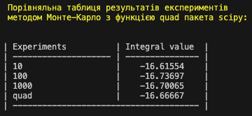

# Algorithms - Homework 10

## Завдання 1

За допомогою моделі було визначено, що при наявних обмеженнях ресурсів:

- Вода - 100 од.
- Цукор - 50 од.
- Лимонний сік - 30 од.
- Фрукторве пюре - 40 од.

максимальна кількість виготовлених продуктів становитиме:

- Лимонад - 30 од.
- Фруктовий сік - 20 од.

## Завдання 2

Було дослджено функцію `5 - x^2`, а саме розраховано інтеграл аналітично методом
Монте-карло та порівняно з чисельним інтегруванням за допомогою функції `quad`
пакету `SciPy`.

Графік функції: 

Отримано наступні результати:

### Висновок

Отже, із результатів експериментів можна побачити, що метод Монте-карло досягає
більш вискої точності при збільшенні кількості експериментів.
